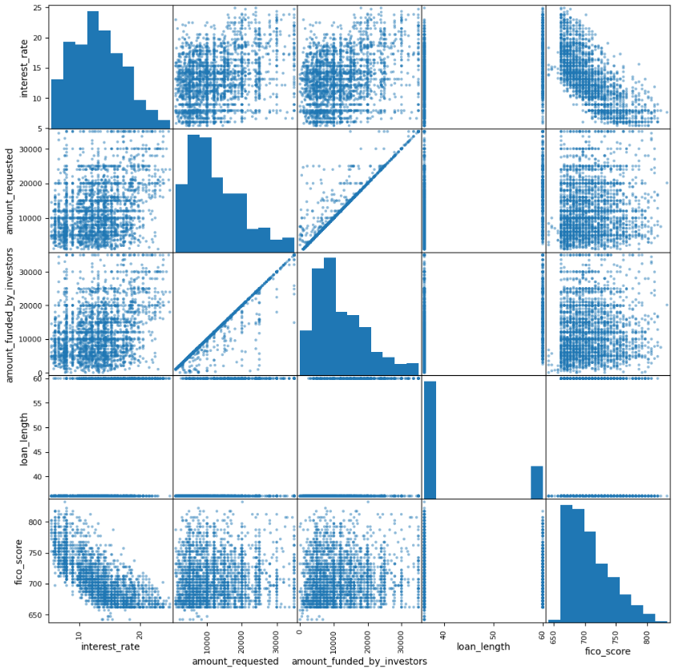
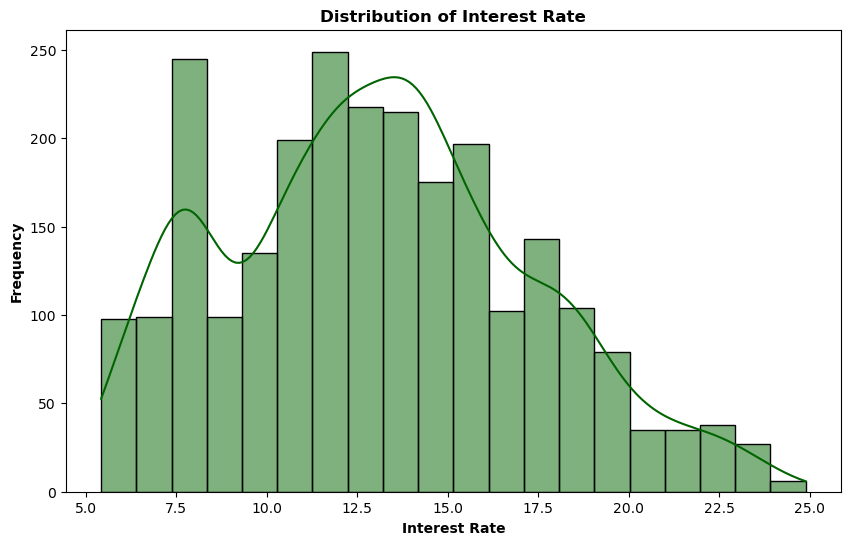
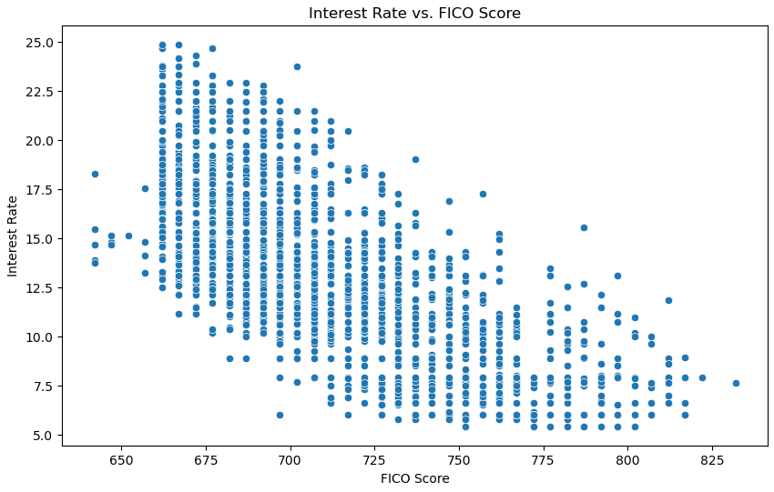
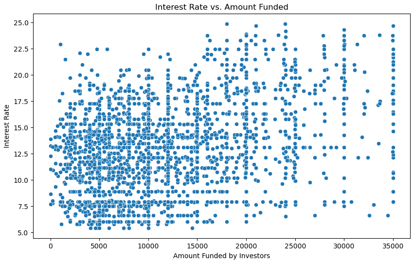
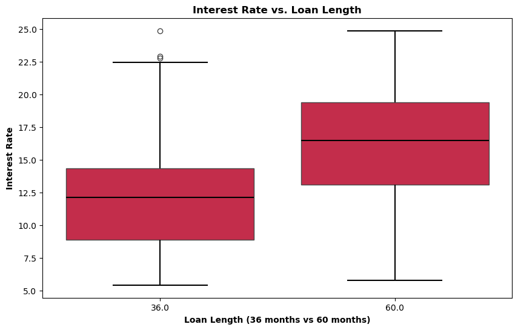
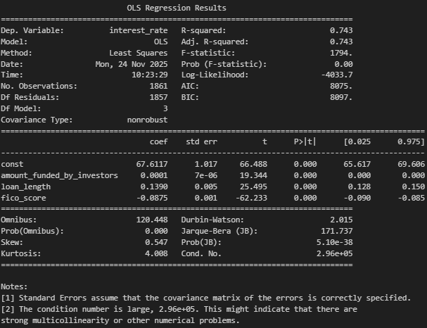
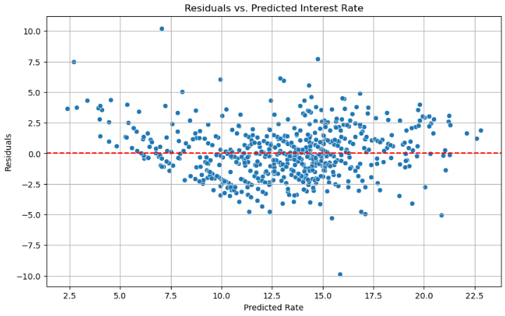

# Overview
## Linear Regression Model on Loans
We performed an explanatory data analysis on a data set regarding loan interest rates.

We then ran a linear regression model on the data to make predictions about how to set potential interest rates.

### 1. Project Objective
Our purpose was to see the relationships that changed depending on the loan's interest rate:

- Were higher FICO score ranges charged lower interest rates?
- Were larger amount of loan funded charged higher interest rates?
- Did longer loan lengths have higher interest rates?

### 2. Data Overview
We plotted the interest rates' relationship with the other features:  

  
  
  
  
  

- FICO score range (38 ranges starting from `640-645` to `820-824`), averaged out into a FICO score
- Amount of loan requested (ignored in our analysis as most loans were fully granted)
- Amount of loan funded (`0` to `$35,000`)
- Length of loan (`36 months` vs. `60 months)`

### 3. Exploratory Insights
Our findings suggest that:

- Loan length (5 years) has the biggest impact on interest rate
- FICO score (averaged in the range) had negative impact on interest rate
- Amount funded by investors had little to no impact

### 4. Modeling Approach
Our manual Linear Regression Model was able to achieve better results than an automatic one:

- Our manual R2 score results was `0.7502`when using `test size` of `0.255`
	- Our manual coefficients were ` 0.000135`, `0.139039`, and `-0.087456` for amount funded, loan length, and FICO score respectively
- Our automatic R2 score in the Ordinary Least Squares table was `0.743`
	- Our automatic coefficients were `0.0001`, `0.1390`, and `-0.0875`; very similar to our manual coefficients

  

Our residuals from testing did not deviate from assumptions of a linear regression model.

  

### 5. Key Results and Recommendations
To have lowest interest rates on a loan, a loan's features should be:

- 3 year duration (instead of 5 year)
- Borrower having higest FICO score range (the closer to 850, the better)